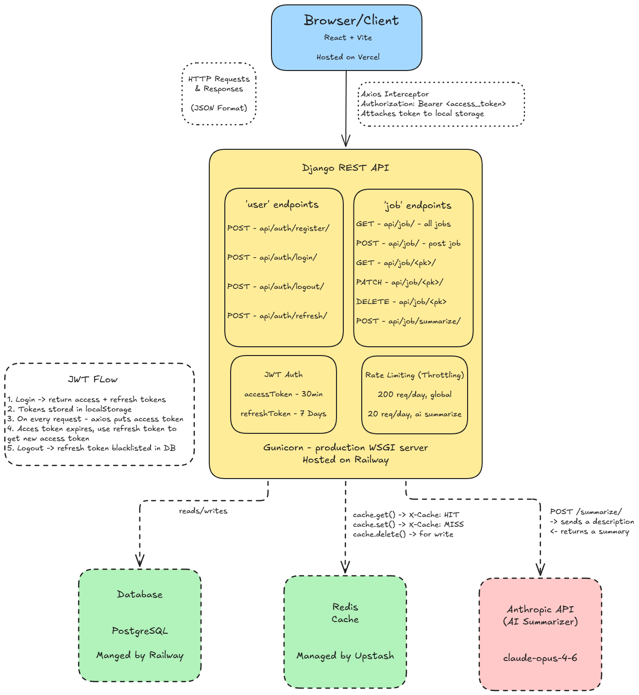

# WorkMe — Job Application Tracker

A full stack job application tracker that helps you manage your job search in one place. Built with Django REST Framework and React.

**Live Demo:** [work-me-job.vercel.app](https://work-me-job.vercel.app/login)

---

## Features

- **JWT Authentication** — secure register, login, logout, and token refresh via `djangorestframework-simplejwt`
- **Job Application CRUD** — create, view, edit, and delete job applications
- **AI-Powered Summarisation** — paste a job description and generate a concise bullet-point summary using the Anthropic API before saving
- **Redis Caching** — API responses are cached in Redis with automatic invalidation on create, update, and delete
- **Rate Limiting** — global throttling on all endpoints, with stricter limits on the AI summarisation endpoint (20 requests/day)
- **Status Filtering & Search** — filter applications by status and search by title or company in real time
- **Responsive Dashboard** — jobs grouped by status with a clean sidebar layout

---

## Tech Stack

### Backend
| Technology | Purpose |
|---|---|
| Django 6 + Django REST Framework | API server |
| PostgreSQL | Primary database |
| Redis (Upstash) | Response caching |
| djangorestframework-simplejwt | JWT authentication |
| Anthropic API | AI job description summarisation |
| Gunicorn | Production WSGI server |
| Whitenoise | Static file serving |
| python-decouple | Environment variable management |

### Frontend
| Technology | Purpose |
|---|---|
| React 18 + Vite | Frontend framework |
| Tailwind CSS v4 | Styling |
| Axios | HTTP client with JWT interceptor |
| React Router v6 | Client-side routing |
| Context API | Global auth state management |

### Infrastructure
| Service | Purpose |
|---|---|
| Railway | Backend + PostgreSQL hosting |
| Upstash | Managed Redis hosting |
| Vercel | Frontend hosting |

---

## Architecture



---

## API Reference

### Authentication
| Method | Endpoint | Auth Required | Description |
|---|---|---|---|
| POST | `/api/auth/register/` | No | Register a new user |
| POST | `/api/auth/login/` | No | Login and receive JWT tokens |
| POST | `/api/auth/refresh/` | No | Refresh access token |
| POST | `/api/auth/logout/` | Yes | Blacklist refresh token |

### Job Applications
| Method | Endpoint | Auth Required | Description |
|---|---|---|---|
| GET | `/api/job/` | Yes | List all jobs for logged-in user |
| POST | `/api/job/` | Yes | Create a new job application |
| GET | `/api/job/<pk>/` | Yes | Retrieve a single job |
| PATCH | `/api/job/<pk>/` | Yes | Partially update a job |
| DELETE | `/api/job/<pk>/` | Yes | Delete a job |
| POST | `/api/job/summarize/` | Yes | Generate AI summary from description |

### Example Request — Create Job
```json
POST /api/job/
Authorization: Bearer <access_token>

{
    "title": "Backend Engineer",
    "company": "Stripe",
    "location": "London, UK",
    "job_url": "https://stripe.com/jobs/backend-engineer",
    "description": "We are looking for a Backend Engineer...",
    "status": "applied",
    "ai_summary": "• Design scalable APIs\n• 3+ years Python experience\n• Competitive salary",
    "applied_at": "2026-04-18"
}
```

### Example Request — Summarise Description
```json
POST /api/job/summarize/
Authorization: Bearer <access_token>

{
    "description": "We are looking for a Backend Engineer..."
}
```

```json
Response:
{
    "summary": "• Design and build scalable APIs handling millions of transactions\n• Requires 3+ years backend experience in Python or Go\n• Experience with PostgreSQL and Redis required\n• Remote-first culture with competitive salary"
}
```

---

## Caching Strategy

All authenticated job endpoints use Redis caching via `django-redis`:

- `GET /api/job/` — cached per user with key `jobs_user_{id}`
- `GET /api/job/<pk>/` — cached per job with key `job_{pk}_user_{id}`
- Cache TTL: 1 hour
- Cache is invalidated automatically on `POST`, `PATCH`, and `DELETE`
- Responses include `X-Cache: HIT` or `X-Cache: MISS` header

---

## Local Development

### Prerequisites
- Python 3.13+
- Node.js 18+
- PostgreSQL
- Redis

### Backend Setup

```bash
# Clone the repo
git clone https://github.com/yourusername/WorkMe-Job.git
cd WorkMe-Job/backend

# Create and activate virtual environment
python -m venv .venv
source .venv/bin/activate  # Windows: .venv\Scripts\activate

# Install dependencies
pip install -r requirements.txt

# Create .env file
cp .env.example .env
# Fill in your values (see Environment Variables section)

# Run migrations
python manage.py migrate

# Start the server
python manage.py runserver
```

### Frontend Setup

```bash
cd WorkMe-Job/frontend

# Install dependencies
npm install

# Update axios base URL in src/api/axios.js to http://localhost:8000/api

# Start the dev server
npm run dev
```

### Environment Variables

Create a `.env` file in the `backend/` folder:

```env
SECRET_KEY=your_django_secret_key
ANTHROPIC_API_KEY=your_anthropic_api_key
DEBUG_STATUS=True
ALLOWED_HOSTS=*
CORS_ALLOW_ALL_ORIGINS=True

DB_HOST=localhost
DB_NAME=your_db_name
DB_USER=your_db_user
DB_PASSWORD=your_db_password
DB_PORT=5432

REDIS=redis://127.0.0.1:6379/1
```

---

## Deployment

### Backend — Railway
- Django app deployed on Railway with Gunicorn
- PostgreSQL managed by Railway
- Redis managed by Upstash
- Migrations run automatically on every deploy via start command:
  ```
  python manage.py migrate && gunicorn core.wsgi:application --bind 0.0.0.0:$PORT
  ```

### Frontend — Vercel
- React app deployed on Vercel
- Auto-deploys on every push to `main`
- Client-side routing handled via `vercel.json` rewrites

---

## Technical Decisions

**Why separate the AI summary from the create flow?**
Generating a summary takes 1-3 seconds. Blocking form submission on an external API call would hurt UX and risk losing user data if the AI call fails. Instead the summary is generated on demand before submission, keeping the save operation fast and reliable.

**Why Redis for caching?**
Job lists are read far more often than they are written. Caching per-user job lists in Redis eliminates repeated database queries for the most common operation in the app. Cache keys are user-scoped to prevent data leakage between users.

**Why JWT over session auth?**
JWT is stateless and works naturally with a decoupled frontend/backend architecture. The refresh token rotation with blacklisting (via `djangorestframework-simplejwt`) provides security without the overhead of server-side session storage.

**Why python-decouple over dotenv?**
`python-decouple` enforces strict separation of configuration from code. Unlike `python-dotenv`, it raises an explicit error if a required variable is missing rather than silently returning `None`, which prevents subtle production bugs.

---

## Project Structure

```
WorkMe-Job/
├── backend/
│   ├── core/                  # Django project settings and URLs
│   ├── user/                  # Auth app (register, login, logout)
│   │   ├── serializers.py
│   │   ├── views.py
│   │   └── urls.py
│   ├── job/                   # Job application app
│   │   ├── models.py
│   │   ├── serializers.py
│   │   ├── views.py
│   │   ├── urls.py
│   │   ├── throttles.py
│   │   └── utils/
│   │       └── ai.py          # Anthropic API integration
│   ├── requirements.txt
│   └── Procfile
└── frontend/
    ├── src/
    │   ├── api/               # Axios instance and API functions
    │   ├── context/           # Auth context and useAuth hook
    │   ├── pages/             # Login, Register, Dashboard
    │   └── components/        # JobCard, JobFormModal, ConfirmDeleteModal
    └── vercel.json
```

---

## License

MIT